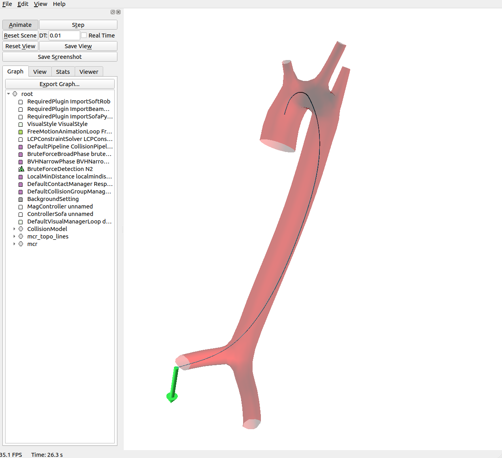
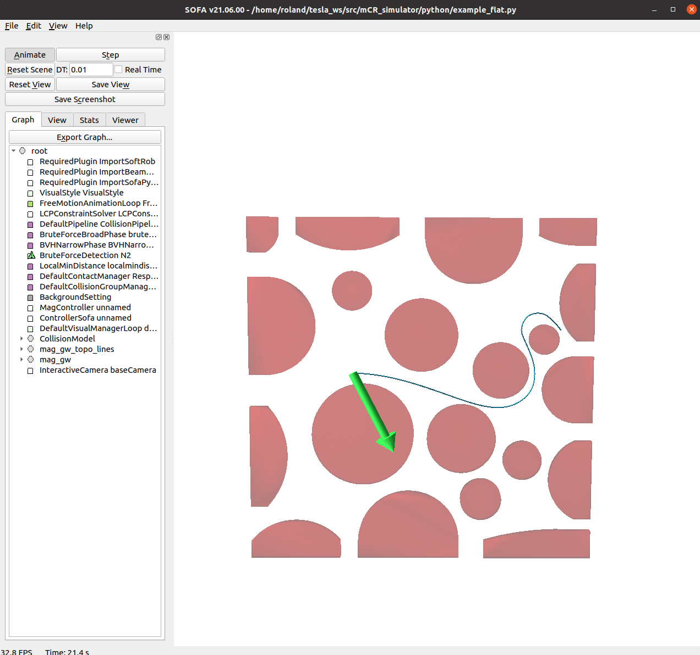

# A Simulation Framework for Magnetic Continuum Robots
 Roland Dreyfus, Quentin Boehler, Bradley J. Nelson

 ## Multimedia materials and source code

 ## Description

 Collection of SOFA scenes to simulate magnetic continuum robots (m-CR), post-process data and generate figures. [SOFA](https://www.sofa-framework.org) (Simulation Open Framework Architecture) is an open-source framework primarily targeted at real-time simulation, with an emphasis on medical simulation

 <table border = "0">
     <tr>
         <td>
         
         </td>
         <td>
         
         </td>
     </tr>
 </table>


 ## Installation

 This requires Ubuntu 20.04 with and Python 3.

 ### Install and build SOFA

 Follow the instructions [here](https://www.sofa-framework.org/community/doc/getting-started/build/linux/) to build SOFA with Linux.

 This code was tested with v.21.12 for SOFA and the external plugins.

 Build SOFA and include the following external plugins using [these instructions](https://www.sofa-framework.org/community/doc/plugins/build-a-plugin-from-sources/):
 * [BeamAdapter](https://github.com/sofa-framework/BeamAdapter)
 * [SoftRobots](https://project.inria.fr/softrobot/)
 * [STLIB](https://github.com/SofaDefrost/STLIB)

 Make sure to use the same version for SOFA and the plugins (these instructions were tested with v21.12), and to load these plugins in the plugin manager of runSofa.

 In CMake GUI, make sure to configure the path to the external plugins in the CMake variable ```SOFA_EXTERNAL_DIRECTORIES```, and check the following boxes:
 * ```PLUGIN_BEAMADAPTER```
 * ```PLUGIN_SOFAIMPLICITFIELD```
 * ```PLUGIN_SOFADISTANCEGRID```
 * ```PLUGIN_PLUGINEXAMPLE```
 * ```PLUGIN_STLIB```
 * ```PLUGIN_SOFTROBOTS```
 * ```SOFA_FETCH_SOFAPYTHON3``` (make sure to follow [these guidelines](https://sofapython3.readthedocs.io/en/latest/menu/Compilation.html) for a proper installation of SofaPython3, and make sure [you load SofaPython3 via the plugin manager of runSofa](https://sofapython3.readthedocs.io/en/latest/menu/SofaPlugin.html#within-runsofa))

 Make sure the box for ```PLUGIN_SOFAPYTHON``` is unchecked.

 ### Install the dependencies

 This repository has the following dependencies:
 * [mag_manip](https://pypi.org/project/mag-manip/): toolbox for electromagnetic navigation systems (eMNS) modelling.

 For installing mag_manip using pip:
 ```
 pip install mag-manip
 ```
 
 ## Usage simulator
 ### Run simulation using shell commands and SOFA user interface

 * Open a terminal and go to the `/bin` directory of SOFA

 ```
 ./runSofa
 ```

 * File/Open to open the scene (extentions *.scn or *.pyscn)
 * Press "Animate" to start the scene

 More information on how to use SOFA [here](https://www.sofa-framework.org/community/doc/).

 ### Manual navigation using keyboard commands. 

 * **Insertion/retraction**
     * CTRL + up/down: insertion/retraction of the m-CR

 * **Magnetic field**
     * CTRL + I/K: inclination angle
     * CTRL + J/L: azimuth angle
 
 ## Post-processing and figure generation
 
 ### Launch Jupyter notebook
 Data processing and figure generation was done in jupiter notebook.

 To launch Jupyter open a terminal, go to the directory `ral_22_sofa_magnetic`, and launch jupyter notebook. This will open a webbrowser window.

 ``` bash
 jupyter notebook notebook/ral_2022_plot_tip_trajectory.ipynb
 ```
 
 ## Tip tracker
 ### Run two-color tip tracker

 * Open a terminal and run:
 To run the tracker open a terminal, go to the directory `ral_22_sofa_magnetic`, and run the python script:

 ```
 python3 python/instrument_tracker.py -v video/MVI_9976.mov
 ```


 Contact:
 Roland Dreyfus: dreyfusr@ethz.ch, 
 Quentin Boehler: qboehler@ethz.ch
